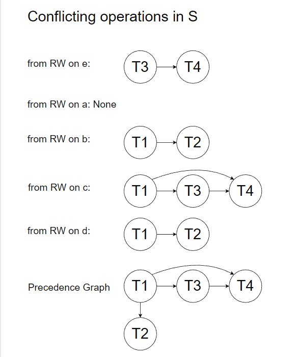

## HW4 Part1 Cost Estimation Solution

Given data
* Num_Records = 6,688,000 records
* Page_Size = 8000 bytes
* Tuple_Size = 100 bytes
* Directory entry size = 10 bytes

Symbols:
* B: # data pages
* D: time to read/write page
* M: # pages in range query

**(Q1.1)** **41800**

		A query with equality select on a key would be a unique result. 
		Thus using the formula as in the slides on average we would find a equality search result within half the number of pages(0.5BD)
		
		Tuple per page: Page_Size / Tuple_Size = 8000 / 100 = 80
	
		Total number of pages with 80 records each = 6,688,000/80 = 83600
	
		We have the average result as 83600/2 = 41800

**(Q1.2)** **3**

		Number of leaf pages - 6,688,000/(8000/100) = 83600
	
		Entry Size - 10B
	
	  	Fan out = 8000/10 = 800
	
		Height of the tree - ceil[log800(83600)] = 2
	
		Cardinality of output - 1
	
		Primary index implies data in the tuple.
	
		The result is the traversing the height of the tree + 1

**(Q1.3)** **4**	

		Number of leaf pages - 6,688,000/(8000/10) = 8360
	
		Fan out: 800
	
		Height of the tree: ceil[log800(8360)] = 2
	
		The result is traversing height of the tree + 1 + 1 (given the secondary index)

**(Q1.4) 4**

```
	Number of leaf pages - 2 * 6,688,000/(8000/10) = 16720

	Fan out = 800 / 2 = 400

	Hence result is height of the tree-ceil[log400(16720)] + 1 + 1(given secondary index)	
```

**(Q1.5)** **2**

		Given no overflow pages, a hash index would have
		1. Cost of one bucket access for the ssn value in the query
		2. Cost of one page access to fetch the record(given that it is secondary)


## Aggregation Queries

**(Q1.6)** **83600**

		Scan everything that is cost is scanning all pages. 

**(Q1.7)**  **3** 

		Since the index is built on salary we have to traverse to rightmost leaf node to fetch the max salary 
	
		The result is cost traversing height of tree(which is same as Q1.3) + 1(given secondary index)
		
		Alternatively, there are partial marks if you have the result - traversing height of tree + #leaves (Since we used AutoGrader, please submit Regrade request if your answer falls in this category.)

---------------------------------
## HW4 Part2 Transaction - Concurrency Solution

**(Q2.1)**



**(Q2.2)** **Yes, because there is no cycle in the precedence graph.**

**(Q2.3)**
- T1, T2, T3, T4
- T1, T3, T2, T4
- T1, T3, T4, T2


**(Q2.4)** **No, after W3(e), there will be an exclusive lock on item e. So for the following R4(e) operation, T4 will not be granted a lock and the operation is disallowed under strict 2PL.**
